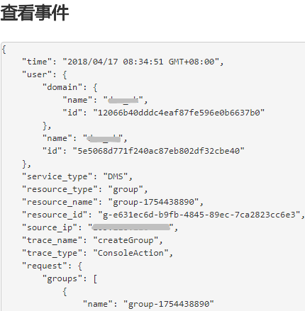

# 查看云审计日志

## 操作场景

云审计服务管理控制台保存最近7天的操作记录。

本节介绍如何在云审计服务管理控制台查看最近7天的操作记录。

## 操作步骤

1.  登录管理控制台。
2.  在管理控制台左上角单击，选择区域。

    > **说明：**   
    >此处请选择与租户的应用服务相同的区域。  

3.  单击页面上方的“服务列表”，选择“管理与部署 \> 云审计服务”，进入云审计服务信息页面。
4.  单击左侧导航树的“事件列表”，进入事件列表信息页面。
5.  事件列表支持通过筛选来查询对应的操作事件。当前事件列表支持以下维度的组合查询，详细信息如下：
    -   事件来源：选择“DMS”。
    -   资源类型：选择“group”、“queue”、“kafka”或者“rabbitmq”。
    -   筛选类型：在下拉框中选择查询条件。

        选择事件名称时，还需选择某个具体的事件名称。

        选择资源ID时，还需选择某个具体的资源ID。

        选择资源名称时，还需选某个具体的资源名称。

    -   操作用户：在下拉框中选择某一具体的操作用户，此操作用户指用户级别，而非租户级别。
    -   事件级别：可选项为“所有事件级别”、“normal”、“warning”、“incident”，只可选择其中一项。
    -   起始时间、结束时间：可通过选择时间段查询操作事件。

6.  在需要查看的记录左侧，单击展开该记录的详细信息，展开记录如[图1](#fig4207614613)所示。

    **图 1**  展开记录  
    

7.  在需要查看的记录右侧，单击“查看事件”，弹出一个窗口，如[图2](#fig1920841417118)所示，显示了该操作事件结构的详细信息。

    **图 2**  查看事件  
    

